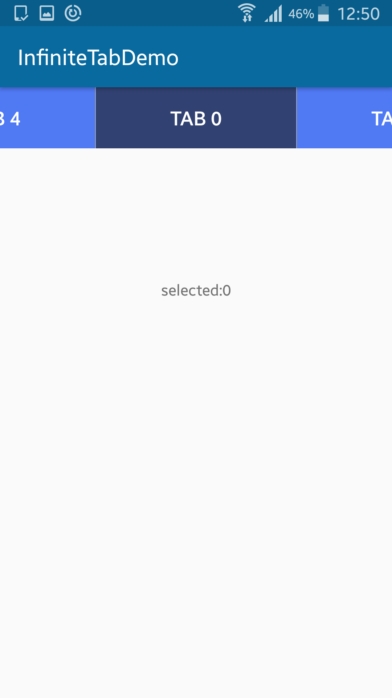

# InfiniteTabsView
InfiniteScrolling Tabs in android
How to

To get a Git project into your build:

Step 1. Add the JitPack repository to your build file

Add it in your root build.gradle at the end of repositories:

	allprojects {
		repositories {
			...
			maven { url 'https://jitpack.io' }
		}
	}
  
Step 2. Add the dependency

		dependencies {
		 compile 'com.github.Manuaravind1989:InfiniteTabsView:1.0.0'
	}

Implementation of tabs

        infiniteTabView = (InfiniteTabView) findViewById(R.id.infiniteTabs);
        horizontalItem = (TextView)findViewById(R.id.positionTitle);

        infiniteTabView.setUnSelectedColor(Color.parseColor("#5079f4"));
        infiniteTabView.setSelectedColor(Color.parseColor("#314172"));
      // infiniteTabView.setTextSelectedColor(Color.RED);

Create a List of tabs

        final List<String> Tabs = new ArrayList<String>();
        int size = 5;
        for (int i = 0; i < size; i++) {
            Tabs.add("TAB " + i);
        }
	
Set tabs to TabLayoutManager	

        final TabLayoutManager tabLayoutManager = new TabLayoutManager();
        tabLayoutManager.attach(infiniteTabView, Tabs);
        tabLayoutManager.setOnItemSelectedListener(new TabLayoutManager.OnItemSelectedListener() {
            @Override
            public void onItemSelected(RecyclerView recyclerView, View item, int position) {
                horizontalItem.setText("selected:" + position + "\n");
            }
        });
	
Set tabs to infiniteTabAdapter

        InfiniteTabAdapter infiniteTabAdapter = new InfiniteTabAdapter(Tabs);
        infiniteTabAdapter.setOnItemClickListener(new InfiniteTabAdapter.OnItemClickListener() {
            @Override
            public void onItemClick(View view, int position) {
                infiniteTabView.smoothScrollToPosition(position);
            }
        });
        infiniteTabView.setAdapter(infiniteTabAdapter);

